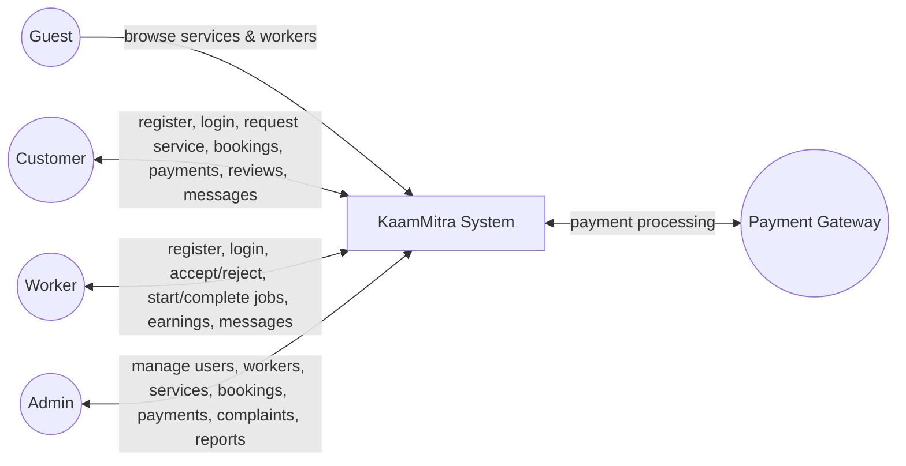
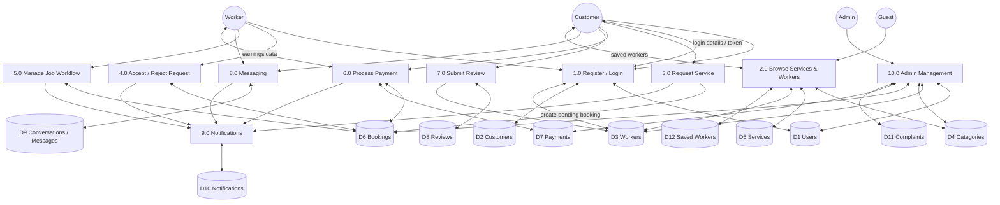
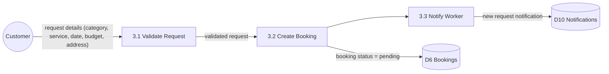
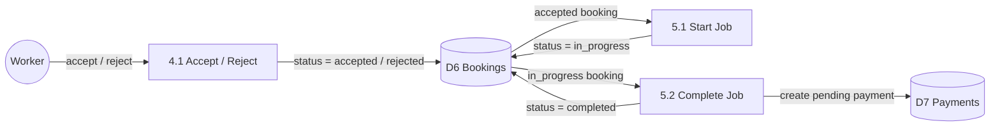
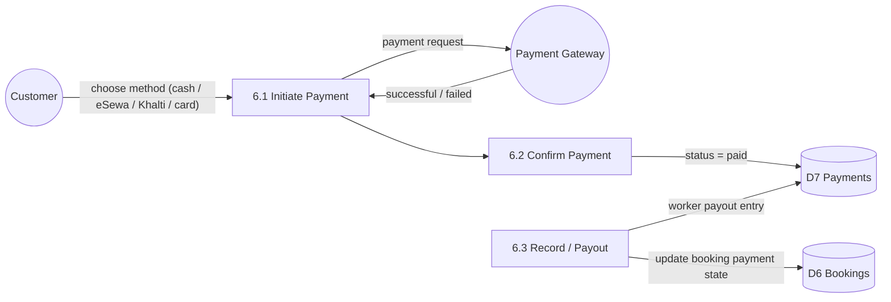
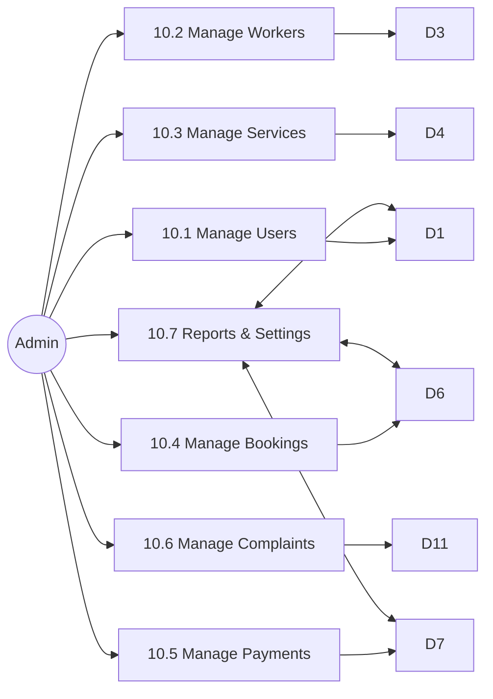

# 02 — Data Flow Diagrams (DFD)

## Conventions

| Symbol | Meaning | Mermaid shape |
|--------|---------|---------------|
| Circle / entity | External entity (actor) | `((text))` |
| Rounded box | Process | `[text]` |
| Open-ended box / cylinder | Data store | `[(text)]` |
| Arrow with label | Data flow | `-->\|label\|` |

Process numbering: **1.0 Register/Login**, **2.0 Browse**, **3.0 Request**,
**4.0 Accept/Reject**, **5.0 Job Workflow**, **6.0 Payment**,
**7.0 Review**, **8.0 Messaging**, **9.0 Notifications**, **10.0 Admin**.

---

## Level 0 — Context Diagram

The whole system as a single process with external entities only.

---

## Level 1 — Main Processes

### Data stores (Level 1)

| Store | Contents |
|-------|----------|
| D1 Users | login credentials, role, status |
| D2 Customers | customer profile (name, email, phone, location) |
| D3 Workers | worker profile (profession, price, skills, rating, verification) |
| D4 Categories | the 5 main service categories |
| D5 Services | sub-services under each category |
| D6 Bookings | service requests and their status lifecycle |
| D7 Payments | payment records per booking |
| D8 Reviews | ratings & comments |
| D9 Conversations / Messages | chat history |
| D10 Notifications | in-app notifications |
| D11 Complaints | complaint records |
| D12 Saved Workers | customer → worker saves |

---

## Level 2 — Detailed Processes

### 3.0 Request Service (Customer → Booking)

### 4.0 / 5.0 Accept-Reject and Job Workflow

### 6.0 Payment

### 10.0 Admin Management

