# 03 — Use Case Diagram

## Actors

| Actor | Description |
|-------|-------------|
| **Guest** | Unregistered visitor — can browse public information only |
| **Customer** | Registered user who hires workers |
| **Worker** | Registered professional who provides services |
| **Admin** | Platform administrator |
| **Payment Gateway** | External system (eSewa / Khalti / Card) that processes payments |
| **Notification Service** | Supporting actor that delivers in-app notifications |

## Use Case Diagram (Mermaid)

```mermaid
flowchart LR
    %% Actors
    Guest((Guest))
    Customer((Customer))
    Worker((Worker))
    Admin((Admin))

    subgraph Auth["Authentication & Accounts"]
        UC1(("Register"))
        UC2(("Login"))
        UC3(("Forgot / Reset Password"))
        UC4(("Manage Profile & Settings"))
        UC5(("Change Password"))
    end

    subgraph Public["Public Features"]
        UC6(("Browse Services & Categories"))
        UC7(("Search / Filter Workers"))
        UC8(("View Worker Profile"))
        UC9(("How It Works"))
    end

    subgraph CustomerPortal["Customer Portal"]
        UC10(("Save Worker"))
        UC11(("View Saved Workers"))
        UC12(("Submit Service Request"))
        UC13(("View My Bookings"))
        UC14(("View Booking Details"))
        UC15(("Cancel Booking"))
        UC16(("Chat with Worker"))
        UC17(("Pay for Service"))
        UC18(("Submit Review"))
        UC19(("View Notifications"))
    end

    subgraph WorkerPortal["Worker Portal"]
        UC20(("View Job Requests"))
        UC21(("Accept Request"))
        UC22(("Reject Request"))
        UC23(("View My Jobs"))
        UC24(("Start Job"))
        UC25(("Complete Job"))
        UC26(("View Earnings"))
        UC27(("Request Withdrawal"))
        UC28(("Chat with Customer"))
        UC29(("Toggle Availability"))
        UC30(("Update Worker Profile"))
    end

    subgraph AdminPanel["Admin Panel"]
        UC31(("View Dashboard Stats"))
        UC32(("Manage Customers"))
        UC33(("Manage Workers"))
        UC34(("Manage Services"))
        UC35(("Manage Bookings"))
        UC36(("Manage Payments"))
        UC37(("Manage Complaints"))
        UC38(("View Reports"))
        UC39(("Platform Settings"))
    end

    %% Guest
    Guest --> UC9
    Guest --> UC6
    Guest --> UC7
    Guest --> UC8
    Guest --> UC1
    Guest --> UC3

    %% Customer
    Customer --> UC2
    Customer --> UC10
    Customer --> UC11
    Customer --> UC12
    Customer --> UC13
    Customer --> UC14
    Customer --> UC15
    Customer --> UC16
    Customer --> UC17
    Customer --> UC18
    Customer --> UC19
    Customer --> UC4

    %% Worker
    Worker --> UC2
    Worker --> UC20
    Worker --> UC21
    Worker --> UC22
    Worker --> UC23
    Worker --> UC24
    Worker --> UC25
    Worker --> UC26
    Worker --> UC27
    Worker --> UC28
    Worker --> UC29
    Worker --> UC30

    %% Admin
    Admin --> UC31
    Admin --> UC32
    Admin --> UC33
    Admin --> UC34
    Admin --> UC35
    Admin --> UC36
    Admin --> UC37
    Admin --> UC38
    Admin --> UC39

    %% include relationships
    UC12 -.->|"<<include>> requires login"| UC2
    UC13 -.->|"<<include>> requires login"| UC2
    UC17 -.->|"<<include>> requires completed job"| UC25
    UC18 -.->|"<<include>> requires completed job"| UC25
    UC21 -.->|"<<extend>> creates job"| UC23
    UC16 -.->|"<<extend>> from booking"| UC14
```

---

## Use Case Descriptions

| ID | Use Case | Actor | Description | Precondition | Postcondition |
|----|----------|-------|-------------|--------------|---------------|
| UC1 | Register | Guest | Create account with name, email/phone, password, and role (customer/worker) | Valid unique email/phone | Account created; worker accounts pending verification |
| UC2 | Login | Customer, Worker, Admin | Authenticate with email or phone + password; receive JWT | Account exists and is active | JWT access token issued |
| UC3 | Forgot / Reset Password | Guest | Request reset link, set a new password | Registered email/phone | Password updated via secure token |
| UC4 | Manage Profile & Settings | Customer, Worker | Update name, contact, location, notification preferences | Logged in | Profile updated |
| UC6 | Browse Services & Categories | Guest | View 5 categories and sub-services | — | Service list shown |
| UC7 | Search / Filter Workers | Guest, Customer | Filter by service, location, category, rating, price, availability, verification | — | Matching workers displayed |
| UC8 | View Worker Profile | Guest, Customer | See worker details, skills, rating, reviews, pricing | — | Profile rendered from DB |
| UC10 | Save Worker | Customer | Add a worker to saved list | Logged in as customer | Worker saved (D12) |
| UC12 | Submit Service Request | Customer | Fill request form (category, service, description, date, time, budget, address) | Logged in | Booking created with status *pending*; worker notified |
| UC13 | View My Bookings | Customer | List all bookings by status | Logged in | Booking list shown |
| UC15 | Cancel Booking | Customer | Cancel a booking before acceptance | Booking not completed/cancelled | Booking status *cancelled* |
| UC17 | Pay for Service | Customer | Pay via cash, eSewa, Khalti, or card | Booking completed | Payment recorded as paid |
| UC18 | Submit Review | Customer | Rate (1–5) and comment on a completed booking | Booking completed | Review saved; worker rating recalculated |
| UC20 | View Job Requests | Worker | See pending requests from customers | Logged in, verified worker | Requests list shown |
| UC21 | Accept Request | Worker | Accept a pending request | Request pending | Booking status *accepted*; customer notified |
| UC22 | Reject Request | Worker | Decline a pending request | Request pending | Booking status *rejected* |
| UC24 | Start Job | Worker | Mark accepted job as in progress | Booking accepted | Booking status *in_progress* |
| UC25 | Complete Job | Worker | Mark job completed; triggers pending payment | Booking in progress | Booking *completed*; payment created |
| UC26 | View Earnings | Worker | See total, pending, and per-job amounts | Logged in as worker | Earnings summary shown |
| UC27 | Request Withdrawal | Worker | Request payout of earned balance | Earnings > 0 | Payout request created |
| UC31 | View Dashboard Stats | Admin | See customers, workers, bookings, revenue | Admin login | Stats rendered from DB |
| UC32 | Manage Customers | Admin | Search customers; enable/disable accounts | Admin login | Customer status updated |
| UC33 | Manage Workers | Admin | Approve, reject, suspend, activate workers | Admin login | Worker verification status updated |
| UC34 | Manage Services | Admin | Add, edit, enable/disable categories & services | Admin login | Service list updated |
| UC35 | Manage Bookings | Admin | Search, view, cancel any booking | Admin login | Booking status updated |
| UC36 | Manage Payments | Admin | Search, view, mark payments paid | Admin login | Payment status updated |
| UC37 | Manage Complaints | Admin | View and change complaint status | Admin login | Complaint status updated |
| UC38 | View Reports | Admin | See platform statistics | Admin login | Report data shown |
| UC39 | Platform Settings | Admin | Maintenance mode, registration toggles, currency | Admin login | Settings persisted |

---

## Key Scenarios

### Scenario 1 — Full service cycle (happy path)
1. Guest registers as Customer → `UC1`
2. Customer searches for a plumber → `UC7`
3. Customer views worker profile → `UC8`
4. Customer submits service request → `UC12` (status *pending*)
5. Worker sees request → `UC20`, accepts → `UC21` (status *accepted*)
6. Worker starts job → `UC24` (*in_progress*)
7. Worker completes job → `UC25` (*completed*, pending payment created)
8. Customer pays → `UC17`
9. Customer reviews → `UC18` (rating updated)
10. Worker views earnings → `UC26`

### Scenario 2 — Admin approval of a new worker
1. Guest registers as Worker → `UC1` (status *pending*)
2. Admin views workers → `UC33`
3. Admin approves the worker (status *verified*)
4. Worker logs in and starts receiving requests → `UC2`, `UC20`

### Scenario 3 — Complaint handling
1. Customer files a complaint about a booking
2. Admin reviews complaints → `UC37`
3. Admin resolves / closes the complaint