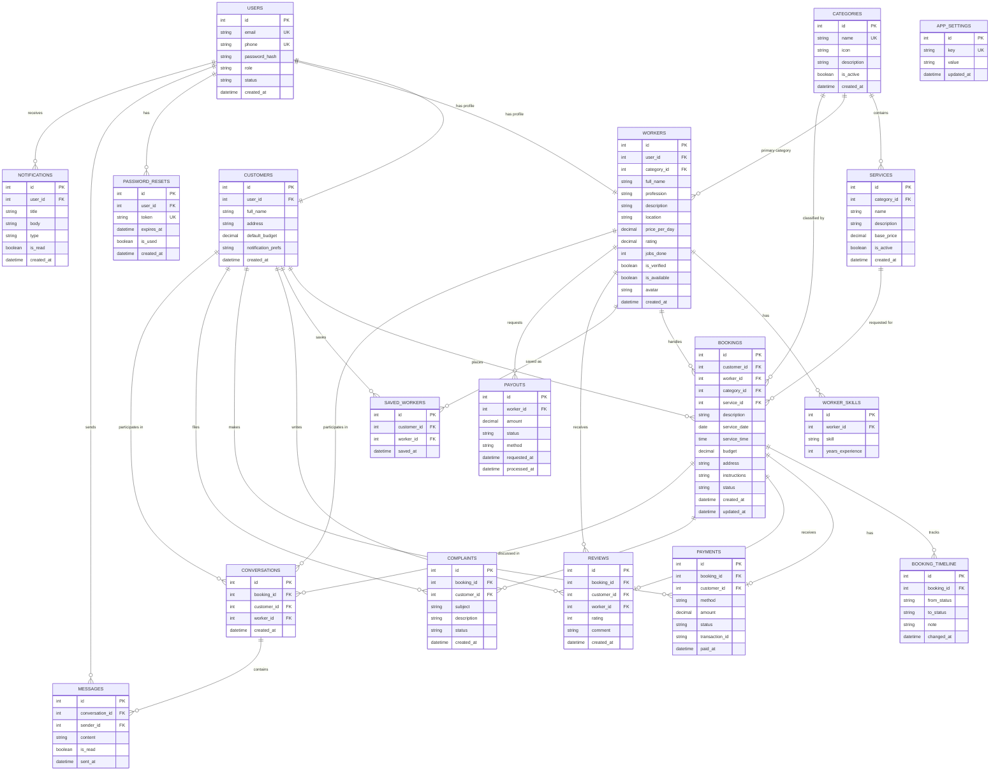

# 04 — Entity Relationship Diagram (ERD)

Database: **MySQL 8.0**, database name `kaammitra`, charset `utf8mb4`.

18 tables derived from the actual frontend pages and their data requirements.

## Entity Relationship Diagram (Mermaid)



---

## Relationship Summary

| # | Left Entity | Cardinality | Right Entity | Meaning |
|---|-------------|-------------|--------------|---------|
| 1 | USERS | 1 — 1 | CUSTOMERS | Every customer profile belongs to one user account |
| 2 | USERS | 1 — 1 | WORKERS | Every worker profile belongs to one user account |
| 3 | USERS | 1 — m | PASSWORD_RESETS | A user may have many password reset requests |
| 4 | USERS | 1 — m | MESSAGES | A user sends many chat messages |
| 5 | USERS | 1 — m | NOTIFICATIONS | A user receives many notifications |
| 6 | CATEGORIES | 1 — m | SERVICES | A category contains many services |
| 7 | CATEGORIES | 1 — m | WORKERS | A category is the workers' primary profession |
| 8 | CATEGORIES | 1 — m | BOOKINGS | Bookings are tagged with a category |
| 9 | WORKERS | 1 — m | WORKER_SKILLS | A worker lists many skills |
| 10 | WORKERS | 1 — m | BOOKINGS | A worker handles many bookings |
| 11 | WORKERS | 1 — m | SAVED_WORKERS | A worker is saved by many customers |
| 12 | WORKERS | 1 — m | REVIEWS | A worker receives many reviews |
| 13 | WORKERS | 1 — m | PAYOUTS | A worker requests many payouts |
| 14 | WORKERS | 1 — m | CONVERSATIONS | A worker has many chats |
| 15 | CUSTOMERS | 1 — m | BOOKINGS | A customer places many bookings |
| 16 | CUSTOMERS | 1 — m | SAVED_WORKERS | A customer saves many workers |
| 17 | CUSTOMERS | 1 — m | REVIEWS | A customer writes many reviews |
| 18 | CUSTOMERS | 1 — m | PAYMENTS | A customer makes many payments |
| 19 | CUSTOMERS | 1 — m | COMPLAINTS | A customer files many complaints |
| 20 | CUSTOMERS | 1 — m | CONVERSATIONS | A customer has many chats |
| 21 | SERVICES | 1 — m | BOOKINGS | A service is requested in many bookings |
| 22 | BOOKINGS | 1 — m | BOOKING_TIMELINE | A booking has a status history |
| 23 | BOOKINGS | 1 — 1 | PAYMENTS | A booking has exactly one payment record |
| 24 | BOOKINGS | 1 — 1 | REVIEWS | A completed booking can have one review |
| 25 | BOOKINGS | 1 — m | COMPLAINTS | A booking may have complaints |
| 26 | BOOKINGS | 1 — m | CONVERSATIONS | A booking may be discussed in chats |
| 27 | CONVERSATIONS | 1 — m | MESSAGES | A conversation contains many messages |

---

## Booking Status Lifecycle

```
pending --> accepted --> in_progress --> completed --> paid
   |          |
   v          v
rejected   cancelled
```

| Status | Set by | Meaning |
|--------|--------|---------|
| `pending` | Customer (submit) | Request created, waiting for worker |
| `accepted` | Worker | Worker accepted the job |
| `rejected` | Worker | Worker declined the request |
| `in_progress` | Worker | Job started |
| `completed` | Worker | Job finished, payment becomes due |
| `paid` | System / Admin | Payment confirmed |
| `cancelled` | Customer / Admin | Booking cancelled before completion |

---

## Key Design Notes

- **Single auth row, separate profiles** — `USERS` holds credentials + role; `CUSTOMERS` and `WORKERS` extend it with profile fields (matches frontend's customer/worker portals sharing the same login form).
- **Payment is 1:1 with booking** — one booking = one payment record, matching `customer/payment.html` history rendering per booking.
- **`is_active`/`status` flags everywhere** — used by admin enable/disable toggles already present in `admin/users.html`, `admin/workers.html`, `admin/services.html`.
- **`BOOKING_TIMELINE`** — enables the status chips (`pending → accepted → ...`) shown in worker and customer booking pages, and future admin audit.
- **No scheduled reminders table** — frontend payment/notification reminders are derived from booking dates at query time.